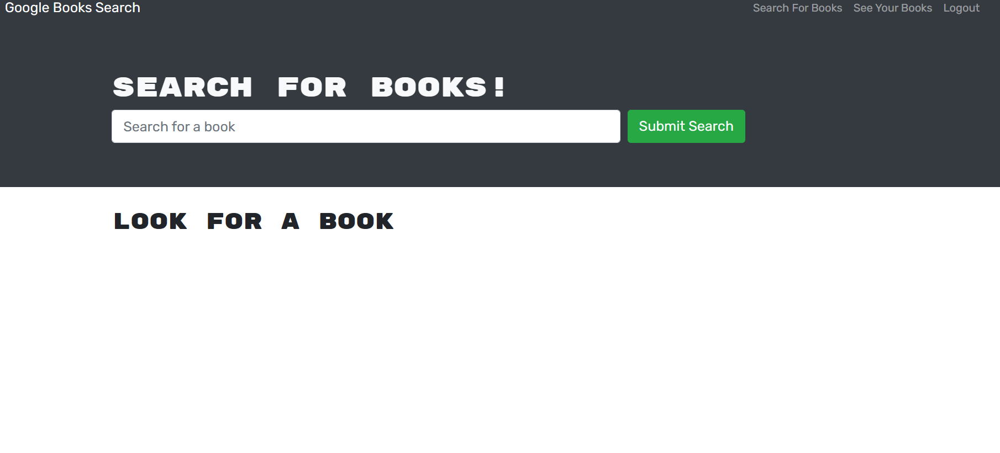

# Book Search Engine

## Licensing:

## Table of Contents 
- [Description](#description)
- [Installation](#installation)
- [Usage](#usage)
- [License](#license)
- [Contributing](#contributing)

## Description:
This application was given as starter code. It has  Google Books API search engine. This a MERN stack app. Users can create accounts, look for books, and save add them to a list. Which will be shown on a separate page, the user sees their saved books and can delete books from the list.

## Usage:

Webpage: https://cool-a13cfdf970c8.herokuapp.com/

Screenshots:

Homepage

Logged in homepage

saved books

searched minecraft books

Back-end Installation: 
- Clone Repo locally 
- Run npm i to install packages
- Running npm run develop to view it  on localhost

## License:
MIT

## Contributing:
TA help from Rob Johnson during office hours

